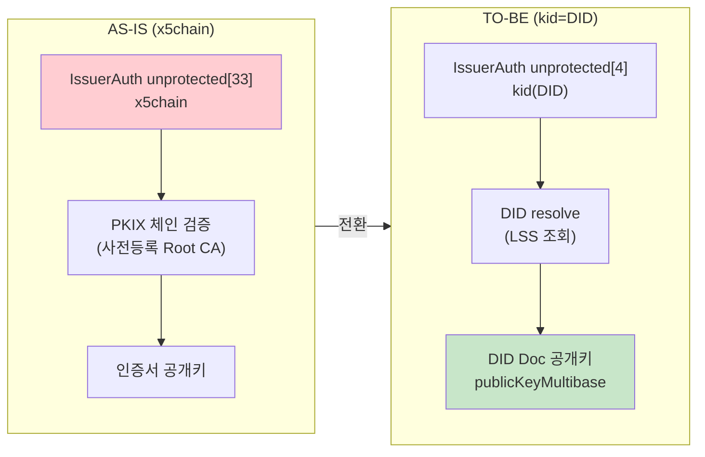
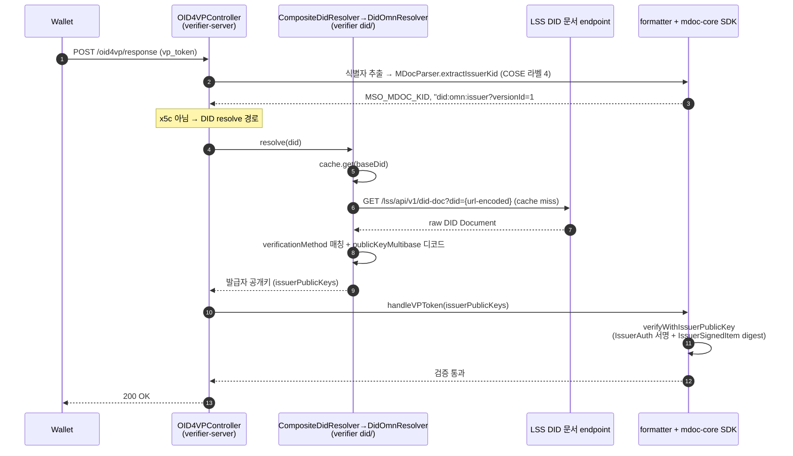
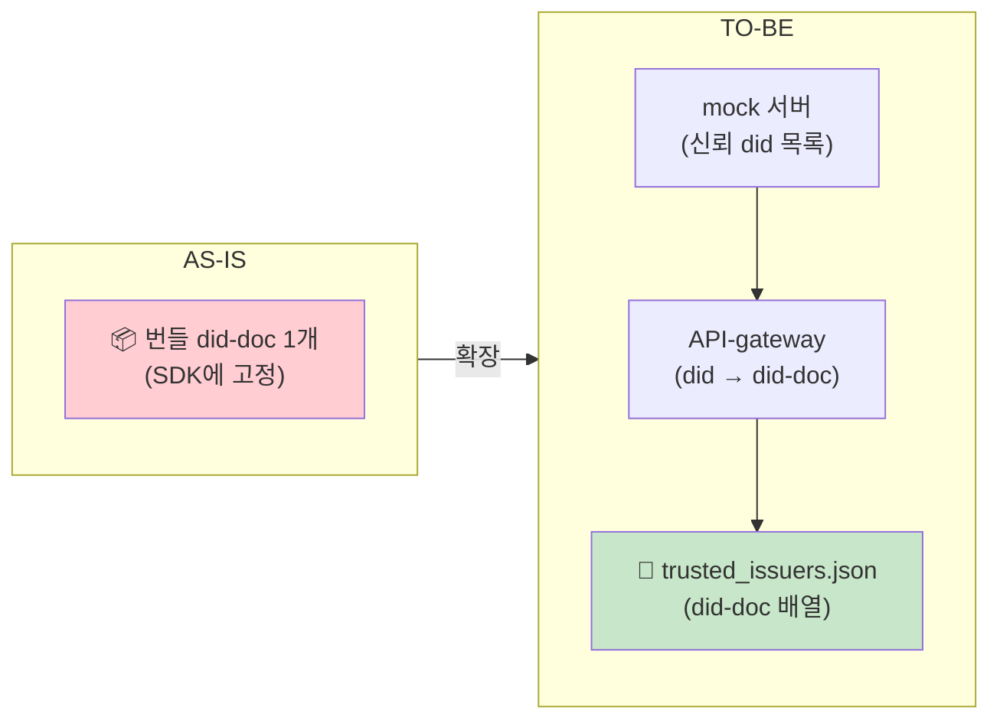
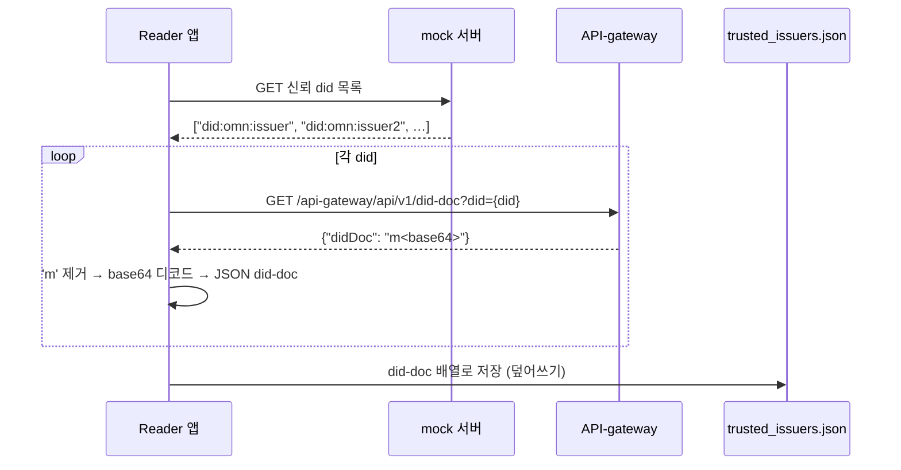
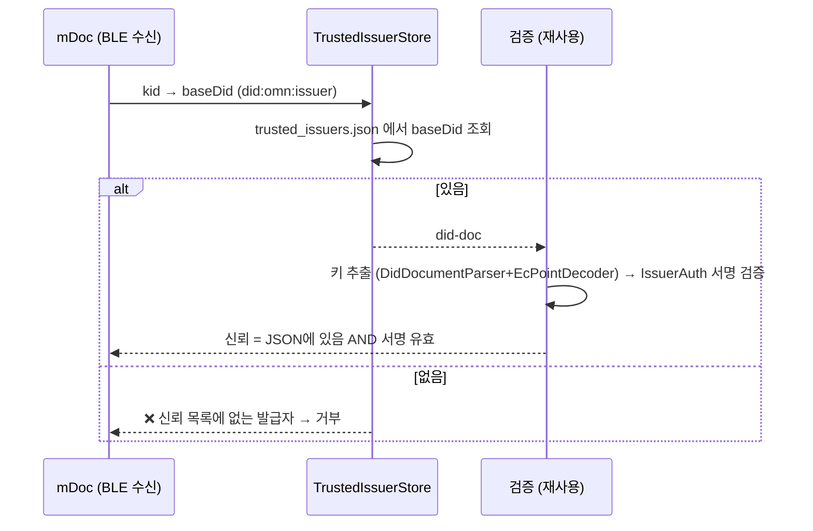
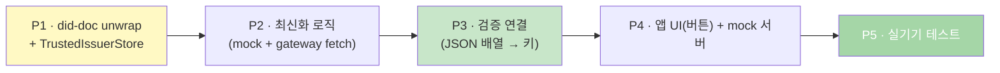

# DID-native mDoc 검증 설계 — 온라인 verifier(OID4VP) + 오프라인 reader(BLE)

> mso_mdoc 의 IssuerAuth(COSE_Sign1)가 발급자를 **x5chain(X.509) 대신 kid(DID)** 로 식별한다. 검증자는 DID Document 의 공개키로 IssuerAuth 서명을 확인한다.
> 두 검증 맥락을 한 문서로 다룬다 — **Part A 온라인 verifier**(OID4VP 웹 제출, 실시간 DID resolve)와 **Part B 오프라인 reader**(BLE/NFC proximity, 사전 캐시). 공통 원리는 같고, 키를 얻는 방식(실시간 LSS 조회 ↔ 로컬 JSON 캐시)만 다르다.

---

## 1. 한눈에 보기 (공통)

```
[Before] IssuerAuth unprotected[33] (x5chain) → PKIX 체인 → 인증서 공개키 → 서명 검증
[After]  IssuerAuth unprotected[4]  (kid=DID)  → DID Document 공개키 → 서명(+digest) 검증
```

| 구분 | **Part A · 온라인 verifier** | **Part B · 오프라인 reader** |
|------|------------------------------|------------------------------|
| 맥락 | OID4VP 웹 제출 (`/oid4vp/response`) | BLE/NFC proximity (ISO 18013-5) |
| 키 획득 | **실시간** DID resolve (LSS 조회) | **사전 캐시** (`trusted_issuers.json`) |
| 신뢰 앵커 | LSS 가 반환하는 DID Document | 신뢰 did 목록(mock) + 캐시된 did-doc |
| 네트워크 | 검증 시 온라인 | 검증 시 **오프라인** (사전 최신화) |
| 서명 검증 | SDK(mdoc-core) `verifyWithIssuerPublicKey` | SDK(reader) `DeviceResponseParser` + COSE |
| 상태 | 서버측 통과 · 실 E2E 실증 | 실기기 통과 |

> **공통 원리**: `kid(DID)` → DID Document → 발급자 공개키 → IssuerAuth COSE_Sign1 서명 검증. 차이는 **키를 어디서 얻느냐**뿐이다.

---
---

# Part A · 온라인 verifier (OID4VP 웹 제출)

## A1. AS-IS / TO-BE



## A2. 검증 시퀀스 (온라인)



> **검증 책임 분리**: verifier-server 는 **"DID → 공개키"(resolution)만** 책임지고, **"공개키로 서명·digest 검증"은 SDK(mdoc-core)** 가 전담한다. 검증 로직이 verifier 와 SDK 에 중복되지 않는다.
> **DeviceAuth(홀더 바인딩)** 는 x5chain 없이 MSO 의 `deviceKey` 로 독립 검증(`verifyDeviceAuthOnly`). **IssuerSignedItem digest 검증**(claim ↔ MSO valueDigests 바인딩)이 포함되어 무결성 갭(H1)이 해소됐다.

## A3. 컴포넌트 (verifier-server `did/`)

| 컴포넌트 | 책임 | 신규/수정 |
|---------|------|:---:|
| **OID4VPController** | 진입점. `MSO_MDOC_KID` 식별자 → resolve → SDK 에 공개키 공급 | 수정 |
| **CompositeDidResolver** | DID method prefix 로 dispatch (PoC 는 `did:omn` 만 활성) | 신규 |
| **DidOmnResolver** | `did:omn` baseDid → **LSS 직접조회 + 캐시** | 신규 |
| **DidDocumentCache** | 메모리 LRU + TTL(24h). 검증기는 상시 온라인이라 디스크 캐시 없음 | 신규 |
| **DidDocumentParser** | `didDocument` 언래핑(raw 허용) + `verificationMethod.id == kid` 매칭(bare-fragment 허용) + `publicKeyMultibase` 디코드(JWK fallback) | 신규 |
| **DidResolution** | `(did, fragment, publicKeyBase64, "Secp256r1")` DTO | 신규 |
| **DidResolverConfig** | resolver 빈 등록, `did.resolver.endpoint`(기본 `:8098`) | 신규 |

> SDK 위임 대상: formatter SDK `MDocVPVerifier`(kid 분류 + core 위임), mdoc-core `MDocParser.extractIssuerKid` / `MDocVerifier.verifyWithIssuerPublicKey`.

## A4. 외부 인터페이스 (LSS)

```
GET {endpoint}/lss/api/v1/did-doc?did={url-encoded-did}
→ raw DID Document (래퍼 없음)
```
- endpoint 기본: `http://localhost:8098` (`did.resolver.endpoint`, 환경변수 `DID_RESOLVER_ENDPOINT`)
- LSS 직접 조회(게이트웨이/issuer 고정 아님). Universal Resolver 래퍼(`{ didDocument, … }`)도 파서가 허용.

## A5. DID resolution 상세

| 항목 | 내용 |
|------|------|
| **캐시** | 메모리 LRU + TTL 24h, 만료 시 재조회. 오프라인 fallback 없음(상시 온라인). |
| **언래핑** | `didDocument` 래퍼가 있으면 꺼내고, 래퍼 없는 raw 문서도 허용. |
| **공개키** | `publicKeyMultibase`(`z` + base58btc, 압축 EC point) 우선 → base64 디코드. 로컬 mock/픽스처용 `publicKeyJwk`(x/y) fallback. |
| **확장성** | `CompositeDidResolver` 가 method prefix 로 dispatch — did:key/did:web 는 resolver 만 추가 등록. |

---
---

# Part B · 오프라인 reader (BLE proximity 캐시)

> mDoc Reader(오프라인 BLE/NFC, ISO 18013-5)가 **신뢰 발급자들의 DID 문서를 로컬 JSON 배열로 캐시**하고, 그 캐시로 오프라인 검증한다. 캐시는 앱 시작/버튼으로 최신화한다. (VICAL 구조는 단일 발급자 PoC엔 과해서 채택하지 않음 — §C2)

## B1. 한눈에 보기 / AS-IS · TO-BE

**검증은 이미 됩니다** (실기기 통과). 이 설계가 더하는 것:

| 더하는 것 | 내용 |
|----------|------|
| **다수 발급자 캐시** | 번들 DID 문서 1개 고정 → **여러 did-doc을 JSON 배열로** 보관 |
| **최신화** | 앱 시작 + "최신화" 버튼 → 신뢰 목록의 did를 받아 각 did-doc을 다시 fetch |

**핵심 아이디어**: 신뢰 목록(어떤 발급자를 믿나)과 캐시(그 발급자들의 키)를 **하나의 JSON 파일**로 합친다. "JSON에 그 did-doc이 있다 = 신뢰 목록에 있다 + 키도 있다 = 오프라인 검증 가능".



## B2. 최신화 흐름 (앱 시작 / 버튼)



## B3. 검증 흐름 (BLE, 오프라인)



## B4. 컴포넌트 (reader `trust/` + SDK `did/` 재사용)

| 컴포넌트 | 책임 | 재사용 |
|---------|------|:---:|
| **TrustedIssuerStore** | `trusted_issuers.json`(did-doc 배열) 로드/조회(baseDid)/저장 | 신규 |
| **IssuerListClient** | mock 서버에서 신뢰 did 목록 GET | 신규 |
| **DidDocClient** | API-gateway GET + `{"didDoc":"m…"}` **base64 unwrap** | `OkHttpFetcher` 재사용 |
| 키 추출·서명검증 | `DidDocumentParser` + `EcPointDecoder` + COSE 검증 | ✅ **Part A 자산 그대로** |
| **mock 서버** | did 목록만 주는 가짜 서버 (우리가 만듦) | 신규 |

> SDK `did/` 에서 `OkHttpFetcher`/`HttpFetcher`/`DidDocumentParser`/`DidResolution` 은 reader 가 재사용. 개별 cache-first resolve 용 `DidDocumentCache`/`DidOmnResolver` 는 reader 설계에 불필요 → **SDK 에서 제거 완료**(커밋 `4052add`). (verifier-server 의 `did/` 동명 클래스와는 별개 — 온라인 경로는 Part A.)

## B5. 외부 인터페이스 (확정)

**API-gateway** (이미 존재):
```
GET {gateway}/api-gateway/api/v1/did-doc?did=did:omn:issuer
→ { "didDoc": "m<base64-no-pad of JSON DID document>" }
```
- `m` = multibase base64(no-pad) → 제거 후 base64 디코드 → JSON did-doc
- 디코드된 문서: bare-fragment id(`assert`) + `publicKeyMultibase` (파서 호환 확인됨)

**mock 서버** (우리가 만듦):
```
GET {mock}/trusted-issuers  →  { "dids": ["did:omn:issuer", …] }
```

### 역할 분담 — mock vs API-gateway

신뢰에 필요한 두 가지("누구를 믿나" + "그의 키")를 **출처가 다른 두 서버**가 나눠 제공한다.

| 출처 | 제공 | 의미 | PoC ↔ 실제 |
|------|------|------|-----------|
| **mock 서버** (우리가 구동) | 신뢰 발급자 **DID 목록** | "누구를 신뢰하나" (신뢰 앵커) | 비서명 하드코딩 → 실제론 **서명된 신뢰목록 관리자/VICAL** |
| **API-gateway** (기존 인프라) | DID **Document**(공개키) | "그 발급자의 키" | 실제 인프라 그대로 |

> **왜 분리하나**: 신뢰 목록은 검증자(reader) 운영 주체가 정하고, 키(did-doc)는 발급자 인프라가 제공한다 — 출처·갱신 주기·신뢰 성격이 다르다. reader 는 둘을 합쳐 `trusted_issuers.json` 한 파일로 만든다 → **"캐시에 있다 = 신뢰 목록에 있다 + 키가 있다 = 오프라인 검증 가능"**(B1 핵심 아이디어).
>
> **PoC 한계**: 현재 mock 은 did 목록을 **비서명 평문**으로 준다(신뢰 앵커 진위 보장 없음). 단일 발급자 PoC엔 충분하나, 실제 운영에선 **서명된 신뢰목록**(VICAL 대응, §C2)으로 대체해야 한다.

## B6. 작업 로드맵 (체크포인트)



- **P1** did-doc base64 unwrap + JSON 배열 store (순수 Java)
- **P2** mock에서 did 목록 → API-gateway에서 각 did-doc → store 갱신
- **P3** 검증 경로를 번들 1개 → JSON 배열 조회로 전환
- **P4** 설정 "최신화" 버튼 + 가짜 mock 서버
- **P5** 실기기에서 최신화 → 오프라인 검증

---
---

# 공통

## C1. 표준 관점 (참고)

| 층위 | X.509 (18013-5) | Part A · verifier | Part B · reader |
|------|-----------------|-------------------|-----------------|
| 키 전달 | x5chain 동봉 | 실시간 LSS DID resolve | API-gateway did-doc fetch → JSON 캐시 |
| 신뢰 앵커 | VICAL (서명 CA 목록) | LSS DID Document | mock 신뢰 did 목록 (비서명, PoC) |

→ reader 의 신뢰 목록(mock)이 VICAL 의 미니멀 대응. 서명된 VICAL 은 §C2 후속.

## C2. 범위 밖 (후속)

- **VICAL** (서명된 issuerIndex), 계층 신뢰(root→CA), revocation(status), docType 권한 — 단일 발급자 PoC엔 과함 (분석 후 보류)
- **mock 서버 → 실제 신뢰목록 관리자**, 신뢰목록 자체 서명
- **발급자 DID allowlist (H2)** · **DID Document 자체 진위 검증** — verifier 가 임의 `did:omn:*` 를 통과시키지 않도록 신뢰 주체 확정 (프로덕션 전)

## C3. 미해결 / 확인 필요

- 🔴 **키 불일치** (reader): API-gateway 가 주는 `did:omn:issuer` 키(`z2AgDFcBobh…`, created 2026-03-24)가 실기기 통과 mDoc 의 서명키(`zuCXMwn3NUC…`, 2025-10-29)와 **다름**. 같은 versionId=1 인데 키가 바뀜 → 발급팀 확인 필요 (키 롤오버 시 versionId 미증가 의심). 이 불일치가 풀려야 최신화 후 실제 검증이 성공.
- mock 서버 / API-gateway **주소**는 설정값(reader: `reader_config.yml`, verifier: `did.resolver.endpoint`).
